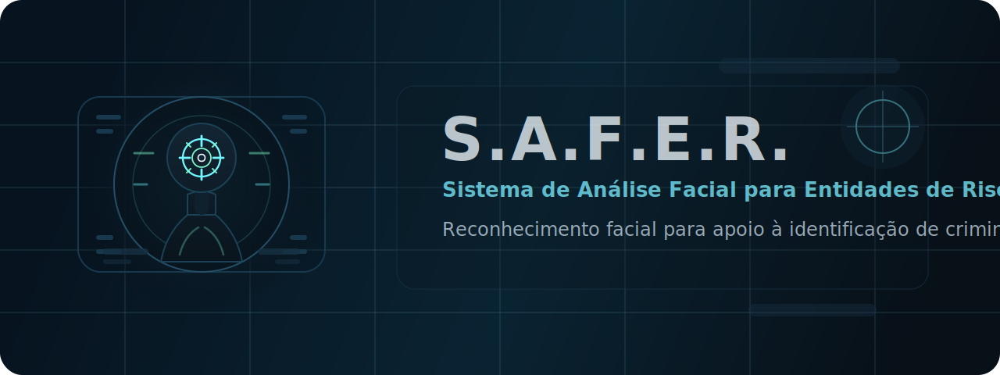

<p align="center">
  
</p>

# S.A.F.E.R.

Repositório do projeto **Sistema de Análise Facial para Entidades de Risco**, desenvolvido para reconhecimento facial com foco na identificação de criminosos.

## Índice

- [Sobre o Projeto](#sobre-o-projeto)
- [Como clonar ou baixar](#como-clonar-ou-baixar)  
- [Estrutura do Projeto](#estrutura-do-projeto)  
- [Licença](#licença)  

## Sobre o Projeto

### Título
S.A.F.E.R. - Sistema de Análise Facial para Entidades de Risco

### Descrição
Sistema de reconhecimento facial para identificação de criminosos.

### Componentes
- Kennymar Bezerra de Oliveira
- Paulo Ricardo Ferreira de Oliveira
- Guilherme Souza de Farias
- Soraia Pereira de Araújo
- Mateus Vinicius Figueredo de Araújo

## Como clonar ou baixar

Você pode obter este repositório de três formas:

### Clonar via HTTPS

```bash
git clone https://github.com/Mateus-VF-Araujo/S.A.F.E.R.git
```

Isso criará uma cópia local do repositório em sua máquina.

### Clonar via SSH

Se você já configurou sua chave SSH no GitHub, pode clonar usando:

```bash
git clone git@github.com:Mateus-VF-Araujo/S.A.F.E.R.git
```

Isso criará uma cópia local do repositório em sua máquina.

### Baixar como ZIP

1. Acesse a página do repositório no GitHub:
   [https://github.com/Mateus-VF-Araujo/S.A.F.E.R](https://github.com/Mateus-VF-Araujo/S.A.F.E.R)
2. Clique no botão **Code** (verde).
3. Selecione **Download ZIP**.
4. Extraia o arquivo ZIP para o local desejado em seu computador.


## Estrutura do Projeto

```text
S.A.F.E.R/
├── assets/
│   └── safer-banner.svg
├── LICENSE
├── README.md
├── main.py
├── pyproject.toml
└── uv.lock
```

- assets: recursos visuais utilizados na documentação do projeto.
- LICENSE: termos da licença do projeto (MIT).
- README.md: este arquivo de apresentação.
- main.py: ponto de entrada atual da aplicação.
- pyproject.toml: metadados e dependências do projeto Python.
- uv.lock: arquivo de travamento das dependências gerenciado pelo `uv`.

## Licença

Este projeto está licenciado sob a **Licença MIT**. Veja o arquivo `LICENSE` para mais detalhes.
